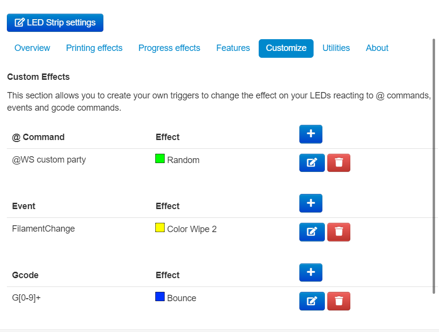

# Custom Triggers


This feature took more effort than most to develop, if you've enjoyed using it please consider [supporting development of the plugin.](https://github.com/sponsors/cp2004)


## Custom @ commands

The simplest custom trigger, a custom @ command. All commands are prefixed as such:`@WS custom <command>` to make sure they do not conflict with others.

You can define your own custom effect to run when this @ command is received.

## Custom Events

You can setup the plugin to react to **any** event you choose for it. For a list of OctoPrint's events, please [see it's documentation](https://docs.octoprint.org/en/master/events/index.html). 3rd party plugins will add their own events, which should appear in the list to select them.

Like above, you can then add a custom effect that will be triggered whenever this event is received.

## Custom Gcode Effects

There's 3 types of triggers here, that you can use.

### Gcode Match

Match **just** the G or M code. For example, if you enter `G28`, the plugin will match `G28 X Y`, or `G28 Z` as well. Or if you enter `G29` it will match `G29 T` as well.

### Exact Match

This will match the entire line sent to the printer. If you just want an effect when homing Z, you could enter `G28 Z` here. The whole line needs to be exactly the same for this effect to trigger.

### Regex Match

Here you can enter a valid regex to run against the lines received from the printer. For example, `G[0-9]+` would match **any** G command sent to the printer. You could use `M50[0-3]` to match any of the EEPROM management commands, M500, M501, M502 or M503.


**Performance Warning**

Adding many regex matches here could (more likely **will**) slow down the communication to the printer. Running a list of regexes against every line sent to the printer is not impact free. If you notice slowdowns, remove the entries here.


