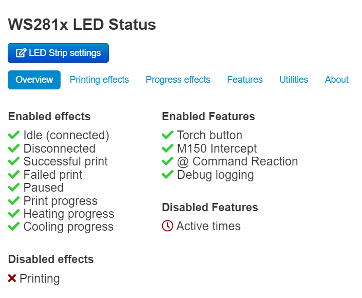

# Initial Configuration

Open the plugin's entry in OctoPrint's settings interface, and you should be presented with this view:

Click on the 'LED Strip Settings' button in the top right. The key settings you should edit are listed below:

* **Strip Type** Select the type of strip you have connected to your Pi.  **Note:** This may not be exactly what you were sold, sometimes they send variations. If you have issues, please try similar strip types here.
* **Number of LEDs** This should be easy, count the number of LEDs you have connected and enter the right number!
* **Max Brightness** This setting controls the maximum brightness that your LEDs should reach.

For more details on the rest of these settings, please see the [full documentation](../../configuration/led-strip-configuration.md)

